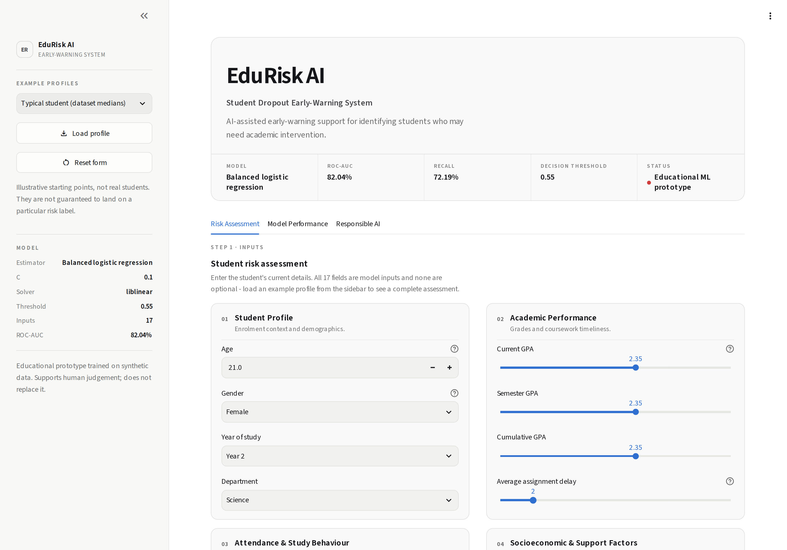
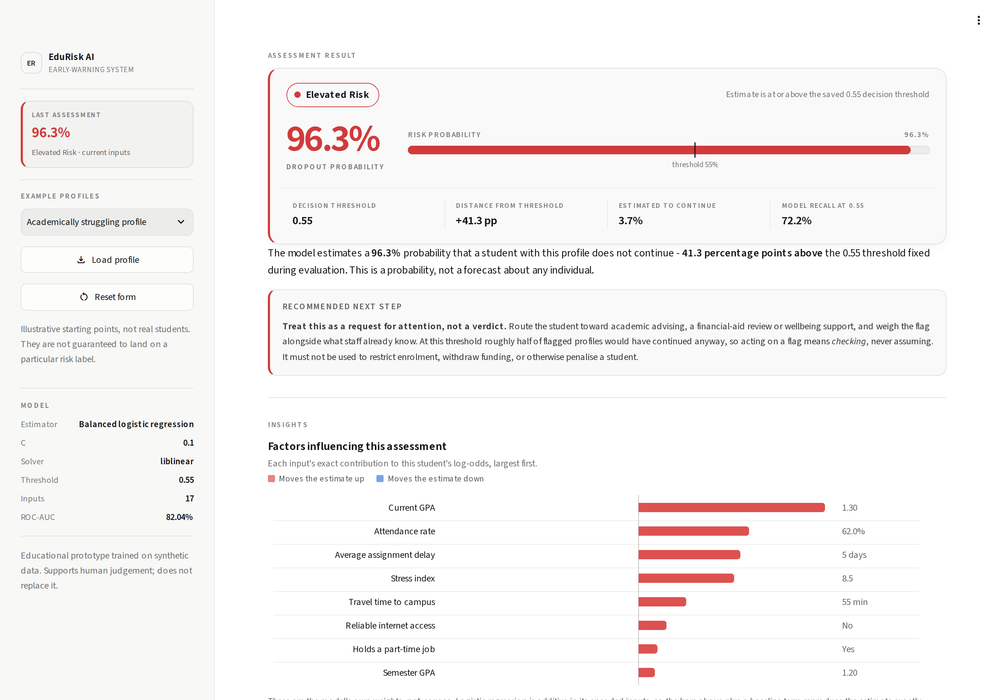
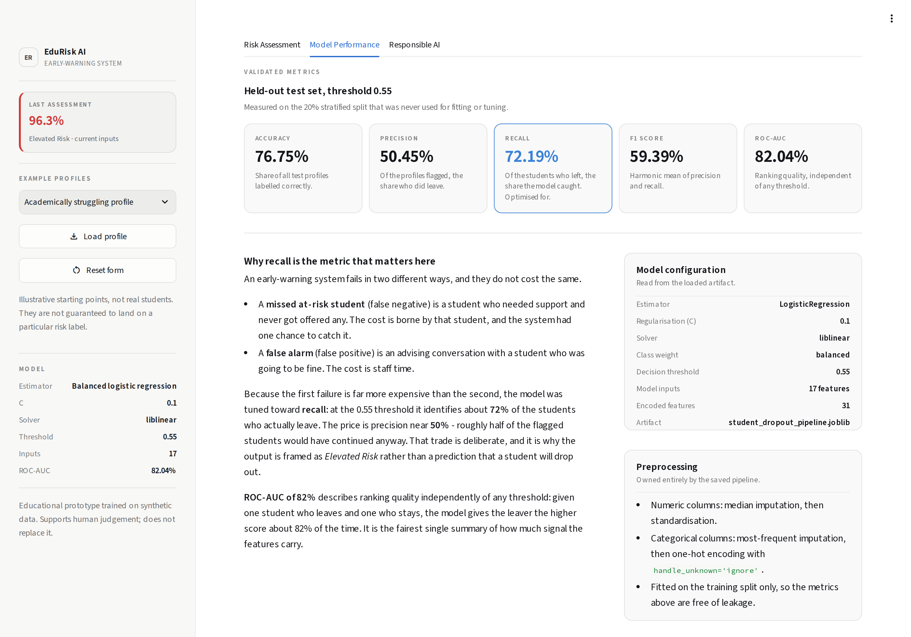
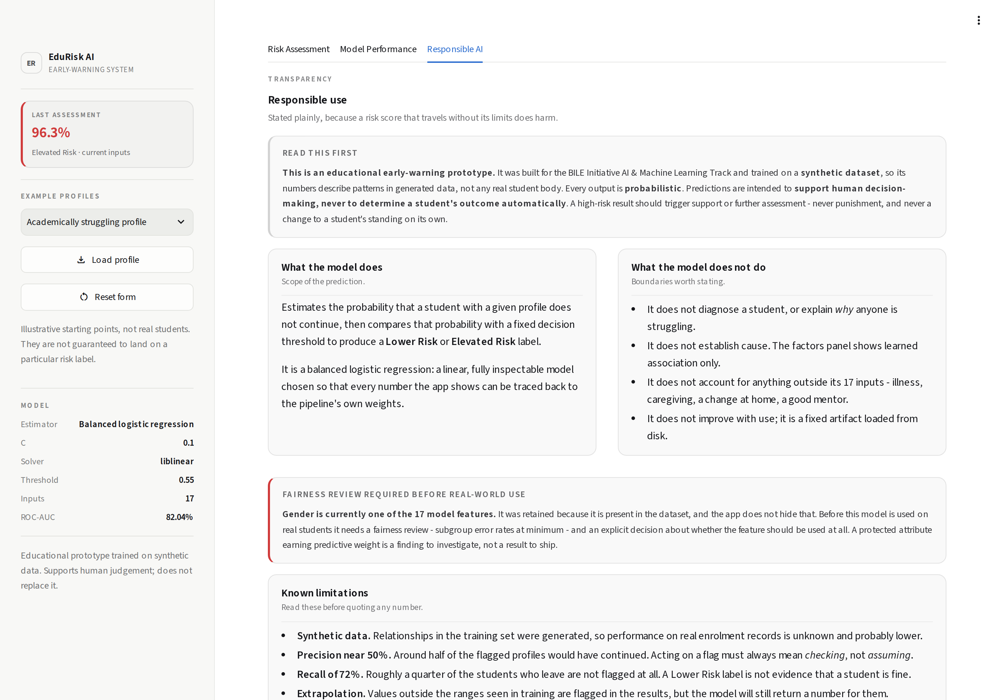
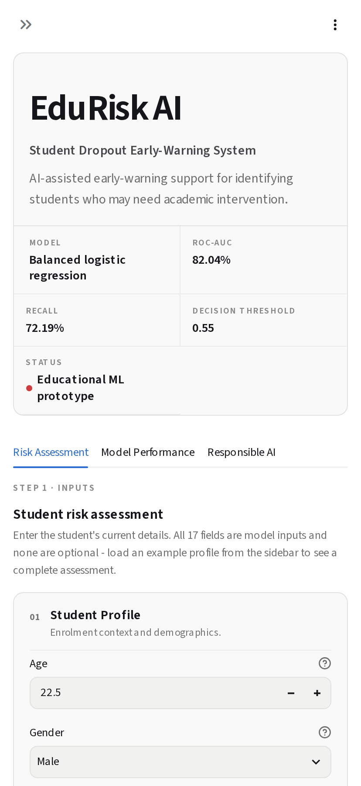

<div align="center">

# EduRisk AI

### Student Dropout Early-Warning System

AI-assisted early-warning support for identifying students who may need academic intervention.

[](https://www.python.org/)
[](https://streamlit.io/)
[](https://scikit-learn.org/)
[](#final-performance)
[](#testing)
[](#responsible-ai--limitations)

</div>

---

> **Educational prototype.** EduRisk AI is trained on a **synthetic dataset** and is built for
> learning and demonstration. It estimates a *probability* that a student may not continue their
> studies. It does **not** determine whether any student will drop out, and it must not be used to
> make decisions about a real student on its own.

---

## Live Demo

> **Deployment pending.** The app will be hosted on Streamlit Community Cloud once the repository is
> published. Replace the line below with the live URL after deployment.

```
Live app: <streamlit-community-cloud-url-goes-here>
```

See [Deployment](#deployment) for the exact settings — including two file-placement changes that are
required before the first deploy will succeed.

---

## Screenshots

| Risk assessment interface | Prediction result |
| :-- | :-- |
|  |  |

| Model performance | Responsible AI |
| :-- | :-- |
|  |  |

<details>
<summary>Mobile view</summary>



</details>

---

## Overview

EduRisk AI turns a trained classification pipeline into a usable decision-support tool. A staff
member enters seventeen data points about a student across four grouped sections; the app scores the
profile with a saved scikit-learn pipeline, applies a fixed decision threshold, and returns a
probability with a **Lower Risk** or **Elevated Risk** label, an explanation of which inputs moved
the estimate, and guidance on what the result should and should not trigger.

The engineering emphasis is on **serving a validated model faithfully**: the app never preprocesses
values itself, never re-derives the threshold, and produces numbers identical to the command-line
`src/predict.py` for the same inputs.

**Highlights**

- End-to-end workflow: EDA → preprocessing pipeline → model comparison → hyperparameter tuning →
  threshold selection → packaged artifact → application.
- Recall-oriented model selection, because in an early-warning system a missed at-risk student costs
  far more than a false alarm.
- Exact per-prediction attribution derived from the model's own coefficients — no post-hoc
  approximation, no invented causal story.
- Responsible-AI disclosures treated as a first-class feature, including an open note that `Gender`
  is currently a model input and needs a fairness review.

---

## Problem Statement

Student attrition is usually visible in the data well before a student formally withdraws — falling
grades, slipping attendance, mounting assignment delays, rising stress. The practical difficulty is
not that the signal is absent but that nobody reviews every student's record in time.

An early-warning system fails in two asymmetric ways:

| Failure | What it means | Who pays |
| :-- | :-- | :-- |
| **False negative** | An at-risk student is never flagged, so no support is offered | The student — and the system had one chance |
| **False positive** | A student who was fine is flagged for a check-in | Staff time |

Because the first is far more costly, EduRisk AI is deliberately tuned toward **recall** and frames
its output as *Elevated Risk* — a prompt to look closer — rather than a prediction of dropout.

---

## Key Features

Every item below is implemented in this repository.

**Assessment**
- Seventeen model inputs in four grouped, numbered sections: Student Profile, Academic Performance,
  Attendance & Study Behaviour, Socioeconomic & Support Factors.
- Sliders, number inputs and select boxes with per-field help text and ranges derived from the
  training data.
- Input validation: out-of-range values and unknown categories block submission; values outside the
  range seen during training are allowed but flagged as extrapolation.
- Three example profiles (typical / academically stable / academically struggling), plus a form
  reset, all clearly labelled as illustrative rather than real students.

**Prediction**
- Probability from `predict_proba()`, classified against the **saved 0.55 threshold** read from the
  artifact — never hard-coded in the app.
- Result panel with the probability figure, a risk-probability bar with the threshold marked in
  place, distance from the threshold, estimated retention, and the model's recall at that threshold.
- **Factors influencing this assessment** — an exact additive decomposition of the log-odds, so the
  displayed contributions plus a baseline term reproduce the estimate to within 1e-9. The section is
  omitted entirely rather than approximated if the pipeline structure cannot be resolved.
- Stale-result detection: changing an input after scoring flags the result as out of date.
- Input summary and a "How this prediction works" walkthrough for auditability.

**Transparency and robustness**
- Model Performance page with the validated held-out metrics and why recall was prioritised.
- Model metadata (estimator, `C`, solver, class weight, threshold, input and encoded-feature counts)
  read live from the loaded artifact rather than typed into the UI.
- Responsible AI page: synthetic-data disclosure, scope and non-scope of the model, fairness note on
  `Gender`, and known limitations.
- Graceful failure: a missing or corrupt artifact produces a clear message and stops the app rather
  than falling back to an untrained model.
- Model loaded once per session with `st.cache_resource`; nothing is retrained at startup.
- Responsive layout (desktop / tablet / mobile) and a light and dark theme.

---

## ML Workflow

```
data/raw/student_dropout_dataset_v3.csv
            │
            ▼
   notebooks/01-eda.ipynb ......... distributions, missingness, correlations, class balance
            │
            ▼
   src/preprocess.py ............. ColumnTransformer: impute → scale / one-hot
            │
            ▼
   src/evaluate.py ............... 5-model comparison + threshold sweep (0.30–0.60)
            │
            ▼
   src/tune.py ................... GridSearchCV over C and solver, 5-fold stratified
            │
            ▼
   src/train.py .................. fit final pipeline, evaluate, save artifact
            │
            ▼
   models/student_dropout_pipeline.joblib   {"model": Pipeline, "threshold": 0.55}
            │
            ├──► src/predict.py ... command-line scoring
            └──► app/app.py ....... EduRisk AI Streamlit application
```

The saved artifact is a dictionary with exactly two keys — the fitted `Pipeline` and the decision
threshold — so serving code cannot drift from training.

---

## Dataset

| Property | Value |
| :-- | :-- |
| File | `data/raw/student_dropout_dataset_v3.csv` |
| Records | 10,000 |
| Original columns | 19 |
| Target | `Dropout` (1 = did not continue) |
| Model inputs | 17 (`Student_ID` and `Dropout` excluded) |
| Encoded features after preprocessing | 31 |
| Source | **Synthetic** — generated for educational use |

`Student_ID` is an identifier with no predictive meaning and is dropped before modelling; it is not
exposed anywhere in the application.

### Class balance

| Class | Share |
| :-- | --: |
| Retained | 76.46% |
| Dropped out | 23.54% |

---

## Exploratory Data Analysis

Full analysis in [`notebooks/01-eda.ipynb`](notebooks/01-eda.ipynb).

### Missing values

| Column | Missing |
| :-- | --: |
| `Family_Income` | 500 |
| `Study_Hours_per_Day` | 500 |
| `Stress_Index` | 500 |
| `Parental_Education` | 511 |

All four are handled inside the pipeline, so imputation statistics are learned from the training
split only.

### Correlation with `Dropout`

| Feature | Correlation |
| :-- | --: |
| `GPA` | −0.460 |
| `Semester_GPA` | −0.445 |
| `CGPA` | −0.445 |
| `Stress_Index` | +0.256 |
| `Attendance_Rate` | −0.164 |

Academic performance shows the strongest linear association, followed by self-reported stress and
attendance.

### Categorical observations

| Group | Dropout rate |
| :-- | --: |
| No internet access | 28.43% |
| Internet access | 22.85% |
| No scholarship | 23.75% |
| Scholarship | 23.16% |

Dropout rates across departments were closely clustered (roughly 23–24%), so `Department` carries
little separating signal on its own.

> **These are associations, not causes.** Nothing in this analysis establishes that changing one of
> these variables would change a student's outcome, and the data is synthetic, so the relationships
> reflect how the dataset was generated.

---

## Preprocessing

Implemented in [`src/preprocess.py`](src/preprocess.py) as a single `ColumnTransformer`, fitted on
the training split and saved inside the artifact:

| Step | Numerical features | Categorical features |
| :-- | :-- | :-- |
| Imputation | median | most frequent |
| Transform | `StandardScaler` | `OneHotEncoder(handle_unknown="ignore")` |

- Numerical and categorical columns are identified by dtype rather than hard-coded lists.
- `handle_unknown="ignore"` means an unseen category degrades gracefully instead of raising.
- 17 model inputs expand to **31 encoded features**.
- Because the transformer is fitted only on training data and travels with the model, there is no
  train/serve skew and no leakage into the reported test metrics.

---

## Model Development

A stratified 80/20 split (`random_state=42`) was held out and used only for final evaluation.

### Model Comparison

Five candidates were compared with the same preprocessing pipeline
([`src/evaluate.py`](src/evaluate.py)):

| Model | Accuracy | Precision | Recall | F1 | ROC-AUC |
| :-- | --: | --: | --: | --: | --: |
| Balanced Logistic Regression | 74.30% | 47.17% | **76.01%** | 58.21% | **82.04%** |
| Logistic Regression | 81.55% | 68.35% | 40.34% | 50.73% | 82.06% |
| Gradient Boosting | 80.55% | 64.34% | 39.07% | 48.61% | 81.33% |
| Random Forest | 80.15% | 63.81% | 36.31% | 46.28% | 80.24% |
| Decision Tree | 73.25% | 43.42% | 44.80% | 44.10% | 63.41% |

> These comparison figures use **default hyperparameters at the default 0.50 threshold** and are the
> basis for choosing a model family — they are not the final reported results. Reproduce with
> `python -m src.evaluate`.

**Reading the table.** Plain Logistic Regression posts the highest accuracy, but it reaches it by
predicting "retained" most of the time: it catches only 40% of the students who actually leave. The
tree ensembles behave the same way. Accuracy is the wrong headline metric on a 76/24 split. Balanced
Logistic Regression trades accuracy for nearly double the recall at an essentially identical
ROC-AUC, which is the trade this problem calls for. It is also linear and fully inspectable, which
is what makes the per-prediction attribution in the app exact rather than approximate.

### Class-Imbalance Strategy

With 23.54% positives, a model that always predicts "retained" scores 76.46% accuracy while being
useless. Two mechanisms address this:

1. **`class_weight="balanced"`** — reweights the loss inversely to class frequency during training,
   so the minority class is not optimised away.
2. **Threshold selection** — the decision boundary is treated as a separate, explicit choice rather
   than left at the default 0.50 (below).

Stratified splitting and stratified 5-fold cross-validation preserve the class ratio throughout.

### Hyperparameter Tuning

[`src/tune.py`](src/tune.py) runs `GridSearchCV` over `C ∈ {0.01 … 10.0}` and
`solver ∈ {liblinear, lbfgs}` with 5-fold `StratifiedKFold`, scoring ROC-AUC, F1 and recall, and
refitting on ROC-AUC. The test split is not touched during tuning.

**Selected configuration**

```python
LogisticRegression(
    C=0.1,
    solver="liblinear",
    class_weight="balanced",
    max_iter=2000,
    random_state=42,
)
```

### Threshold Optimization

Thresholds from 0.30 to 0.60 were swept on the held-out set ([`src/evaluate.py`](src/evaluate.py)):

| Threshold | Accuracy | Precision | Recall | F1 | TP | FP | TN | FN |
| --: | --: | --: | --: | --: | --: | --: | --: | --: |
| 0.30 | 60.00% | 36.09% | 90.66% | 51.63% | 427 | 756 | 773 | 44 |
| 0.35 | 63.90% | 38.28% | 87.05% | 53.18% | 410 | 661 | 868 | 61 |
| 0.40 | 67.60% | 40.79% | 83.23% | 54.75% | 392 | 569 | 960 | 79 |
| 0.45 | 70.70% | 43.27% | 78.56% | 55.81% | 370 | 485 | 1044 | 101 |
| 0.50 | 74.30% | 47.17% | 76.01% | 58.21% | 358 | 401 | 1128 | 113 |
| **0.55** | **76.60%** | **50.22%** | **71.76%** | **59.09%** | 338 | 335 | 1194 | 133 |
| 0.60 | 78.25% | 53.08% | 65.82% | 58.77% | 310 | 274 | 1255 | 161 |

> This sweep was run on the untuned baseline (`C=1.0`), which is why the 0.55 row differs slightly
> from the final figures below — regularising to `C=0.1` shifted them by a few tenths of a point.

**Why 0.55.** Below it, precision collapses — at 0.30 the model flags 1,183 students to catch 427,
which no support team can action. Above it, recall falls away faster than precision improves. 0.55
sits at the F1 peak while still catching roughly seven in ten of the students who leave, and it is
stored *inside the artifact* so the application and the CLI cannot disagree about it.

---

## Final Performance

Balanced Logistic Regression · `C=0.1` · `solver=liblinear` · `class_weight=balanced` ·
**threshold = 0.55**, measured on the held-out 20% test split:

| Metric | Value |
| :-- | --: |
| Accuracy | **76.75%** |
| Precision | **50.45%** |
| Recall | **72.19%** |
| F1-score | **59.39%** |
| ROC-AUC | **82.04%** |

**How to read these honestly.**

- **Recall 72.19%** — about seven in ten students who actually leave are flagged. Roughly a quarter
  are still missed, so a Lower Risk label is not evidence that a student is fine.
- **Precision 50.45%** — about half of flagged students would have continued anyway. This is the
  accepted cost of the recall target, and it is exactly why a flag must trigger a *check*, never an
  assumption.
- **ROC-AUC 82.04%** — threshold-independent ranking quality: given one student who leaves and one
  who stays, the model scores the leaver higher about 82% of the time.
- **Accuracy 76.75%** — barely above the 76.46% majority-class baseline, and deliberately so.
  Accuracy is the least informative metric here.

Reproduce with `python -m src.train`.

---

## Application

The Streamlit application lives in [`app/`](app/) and is split so that presentation never touches
inference:

| Module | Responsibility |
| :-- | :-- |
| `app/app.py` | Page configuration, layout, tabs, session state, callbacks |
| `app/ui.py` | Design system, stylesheet, hero, result panel, contribution chart |
| `app/model_service.py` | Artifact loading and validation, `predict()`, log-odds decomposition |
| `app/schema.py` | The 17 input definitions, grouping, example profiles, validation rules |

**Three pages**

1. **Risk Assessment** — the grouped input form, the primary action, and the result.
2. **Model Performance** — validated metrics, why recall matters, live model configuration.
3. **Responsible AI** — scope, fairness note, and limitations.

**Theming.** All colours are declared per mode under `[theme.light]` and `[theme.dark]` in
`.streamlit/config.toml`, so Streamlit's own theme resolver produces a complete, coherent set in
either appearance. The custom stylesheet is written to be theme-independent — it inherits text
colour and uses neutral alpha surfaces — so nothing becomes unreadable if the viewer switches theme.

---

## Project Architecture

```
04-student-dropout-prediction/
├── .streamlit/
│   └── config.toml                    # per-mode light/dark theme, non-colour design tokens
├── app/
│   ├── app.py                         # Streamlit entrypoint
│   ├── model_service.py               # artifact loading, prediction, attribution
│   ├── schema.py                      # 17 input definitions, profiles, validation
│   └── ui.py                          # design system and custom visuals
├── assets/
│   ├── edurisk-dashboard.png
│   ├── edurisk-prediction.png
│   ├── edurisk-model-performance.png
│   ├── edurisk-responsible-ai.png
│   └── edurisk-mobile.png
├── data/
│   ├── processed/                     # git-ignored working directory
│   └── raw/
│       └── student_dropout_dataset_v3.csv
├── models/
│   └── student_dropout_pipeline.joblib   # {"model": Pipeline, "threshold": 0.55}
├── notebooks/
│   └── 01-eda.ipynb
├── reports/
│   └── figures/                       # exported figures (currently empty)
├── src/
│   ├── __init__.py
│   ├── preprocess.py                  # ColumnTransformer builder
│   ├── train.py                       # fit final model, evaluate, save artifact
│   ├── tune.py                        # GridSearchCV over C and solver
│   ├── evaluate.py                    # model comparison + threshold sweep
│   └── predict.py                     # command-line scoring
├── tests/
│   └── test_app_model_service.py      # 33 tests
├── .gitignore
├── README.md
├── requirements.txt
└── requirements-dev.txt
```

The trained artifact is ~6 KB and is **committed on purpose** so the repository runs immediately
after a clone.

---

## Installation

Requires **Python 3.11 or newer**.

```bash
git clone https://github.com/Mahboub-jr/machine-learning-projects.git
cd machine-learning-projects/bile-initiative/04-student-dropout-prediction
```

<details open>
<summary><b>Windows (PowerShell)</b></summary>

```powershell
python -m venv .venv
.\.venv\Scripts\Activate.ps1
pip install -r requirements.txt
```

If PowerShell blocks the activation script, skip activation and call the interpreter directly:

```powershell
python -m venv .venv
.\.venv\Scripts\python.exe -m pip install -r requirements.txt
```

</details>

<details>
<summary><b>macOS / Linux</b></summary>

```bash
python3 -m venv .venv
source .venv/bin/activate
pip install -r requirements.txt
```

</details>

> `scikit-learn` is pinned to **1.9.0** because the saved pipeline was written with that version and
> does not unpickle reliably across minor releases. Change the pin only if you retrain the model.

---

## Running Locally

Run from the **project root** — `.streamlit/config.toml` is resolved relative to the working
directory, so starting from elsewhere loses the theme.

```bash
streamlit run app/app.py
```

On Windows without activating the virtual environment:

```powershell
.\.venv\Scripts\python.exe -m streamlit run app\app.py
```

The app opens at `http://localhost:8501`.

<details>
<summary>Optional: re-run the ML pipeline</summary>

```bash
python -m src.evaluate     # compare five models, sweep thresholds
python -m src.tune         # GridSearchCV over C and solver
python -m src.train        # fit the final model and overwrite the saved artifact
python -m src.predict      # score the built-in sample record
```

`src/evaluate.py`, `src/tune.py` and `src/predict.py` are read-only with respect to the artifact.
**`src/train.py` overwrites `models/student_dropout_pipeline.joblib`** — only run it if you intend
to retrain.

</details>

---

## Testing

```bash
pip install -r requirements-dev.txt
pytest tests -q
```

**33 tests**, covering:

- **Artifact contract** — the saved threshold really is 0.55; the schema is exactly 17 features;
  `Student_ID` is absent; missing, corrupt and malformed artifacts all raise `ModelLoadError`.
- **Parity with `src/predict.py`** — the app and the CLI return identical probabilities (to 1e-12)
  for the sample record and for every example profile.
- **Column-order invariance** and rejection of incomplete records.
- **Threshold logic** — labels follow the saved threshold, the boundary is inclusive, and the three
  example profiles order sensibly.
- **Interpretability** — the per-feature contributions plus the baseline reconstruct
  `decision_function()` exactly, and the recovered log-odds match the reported probability.
- **Validation** — blocking errors, soft notices, and bounds covering every example profile.

---

## Deployment

Target: **Streamlit Community Cloud**, from `Mahboub-jr/machine-learning-projects`.

| Setting | Value |
| :-- | :-- |
| Repository | `Mahboub-jr/machine-learning-projects` |
| Branch | `main` |
| Main file path | `bile-initiative/04-student-dropout-prediction/app/app.py` |

### Required before the first deploy

Community Cloud looks for files in specific places, and this project sits in a subdirectory. **Two
changes are needed or the deploy will not behave as it does locally.** Both are file placement only —
no code changes.

**1. Dependencies will not be found where they currently sit.**
Community Cloud searches the entrypoint's directory, then the repository root — and nothing in
between. `requirements.txt` currently lives at `bile-initiative/04-student-dropout-prediction/`,
while the entrypoint is in `.../app/`. Copy it next to the entrypoint:

```
bile-initiative/04-student-dropout-prediction/app/requirements.txt
```

Without this, the build installs no dependencies and the app fails on import.

**2. The theme file must be at the repository root.**
Community Cloud only applies `.streamlit/config.toml` from the repository root, so the copy inside
the project folder is ignored once deployed. To keep the light/dark theme, place a copy at:

```
machine-learning-projects/.streamlit/config.toml
```

Without this the app still runs correctly — the stylesheet is theme-independent by design — but it
falls back to Streamlit's stock colours. Note that a root-level config is shared by every app
deployed from this monorepo.

The working directory on Community Cloud is the repository root. The application itself is unaffected
because it resolves the model path relative to its own file, not the working directory.

Sources: [file organization](https://docs.streamlit.io/deploy/streamlit-community-cloud/deploy-your-app/file-organization),
[app dependencies](https://docs.streamlit.io/deploy/streamlit-community-cloud/deploy-your-app/app-dependencies)

---

## Responsible AI & Limitations

This section is not boilerplate. A risk score that travels without its limits does harm.

**What this system is**

- An **educational prototype** built for a machine-learning challenge.
- Trained on a **synthetic dataset**. Its numbers describe patterns in generated data, not any real
  student body.
- **Probabilistic.** Every output is an estimated likelihood, never a statement of fact about a
  person.
- **Decision support.** It is designed to inform a human, and should be weighed alongside everything
  staff already know about a student.

**What it must not be used for**

- It must not independently determine any student's outcome, standing, funding or enrolment.
- An Elevated Risk flag should trigger **support or further assessment — never punishment**. About
  half of flagged students would have continued anyway.
- A Lower Risk label is **not a clearance**. Roughly a quarter of students who leave are not flagged.
- It does not diagnose anyone or explain *why* a student is struggling.

**Fairness**

`Gender` is currently one of the 17 model inputs. It was retained because it is present in the
dataset, and the application states this openly rather than hiding it. **Before any real-world use
this requires a fairness review** — subgroup error rates at minimum — and an explicit decision about
whether the feature should be used at all. A protected attribute earning predictive weight is a
finding to investigate, not a result to ship.

**Known limitations**

| Limitation | Consequence |
| :-- | :-- |
| Synthetic training data | Real-world performance is unknown and probably lower |
| Precision ≈ 50% | Half of flags are false alarms — always verify |
| Recall ≈ 72% | About a quarter of at-risk students are missed |
| 17 inputs only | No visibility into illness, caregiving, housing, mentorship, or life events |
| Threshold is a policy choice | 0.55 encodes one tolerance for false alarms; another institution should revisit it |
| Correlational, not causal | Feature contributions show learned association, never cause |
| Fixed artifact | The model does not learn from use and will drift as populations change |

**Before real-world deployment**, the model would need retraining and validation on representative
real institutional data, a fairness audit across protected groups, a threshold set with the actual
support capacity in mind, and a human-in-the-loop process defined before any flag reaches a student.

---

## Future Improvements

- Retrain and validate on real, representative institutional data.
- Fairness audit with subgroup error rates, and a decision on `Gender` as an input.
- Calibration analysis (reliability curve, Brier score) so the probabilities can be trusted as
  probabilities and not just as rankings.
- Batch scoring for a full cohort, with an exportable ranked list.
- Threshold as a documented, configurable policy tied to available support capacity.
- Model monitoring: drift detection and periodic revalidation.
- Persist the export of EDA figures into `reports/figures/` for the written report.

---

## Developer

**Developed by Nabil Mahboub**

Design, data analysis, model development, evaluation, application engineering and documentation.

---

## Acknowledgement

Built for the **BILE Initiative — AI & Machine Learning Track**.

Thanks to the BILE Initiative for the challenge brief and the practical framing that shaped this
project's focus on responsible, deployment-ready machine learning.

---

<div align="center">

**EduRisk AI** · Student Dropout Early-Warning System<br>
Educational prototype · synthetic data · supports human judgement, does not replace it

</div>
